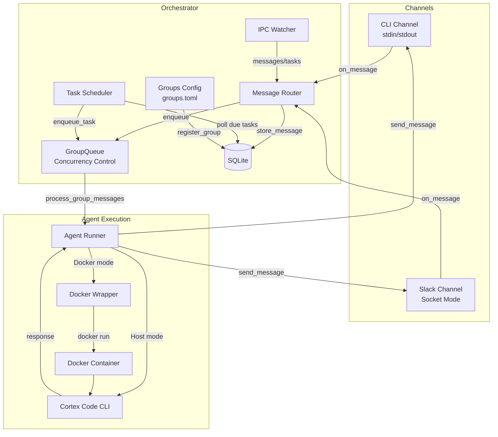
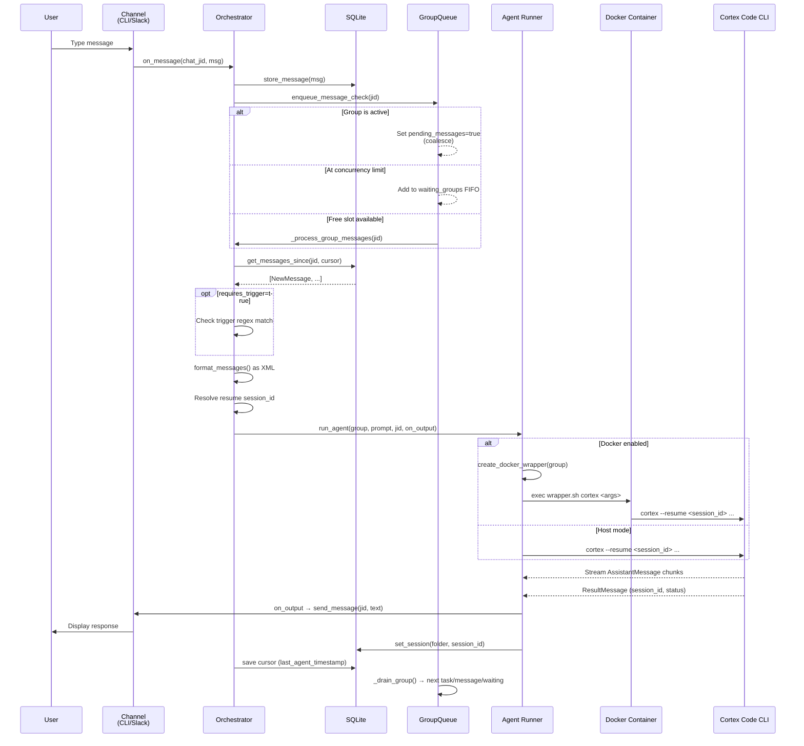
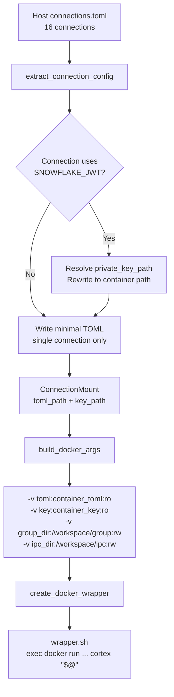
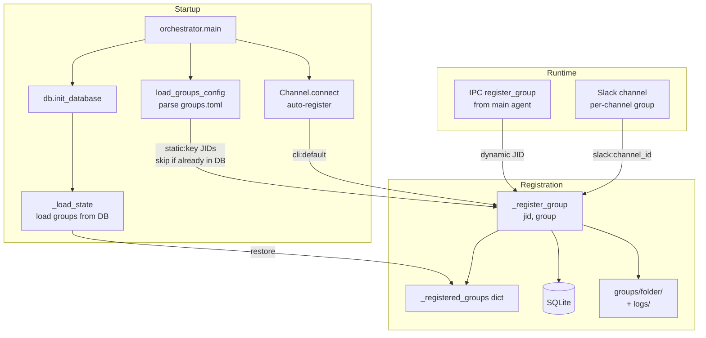
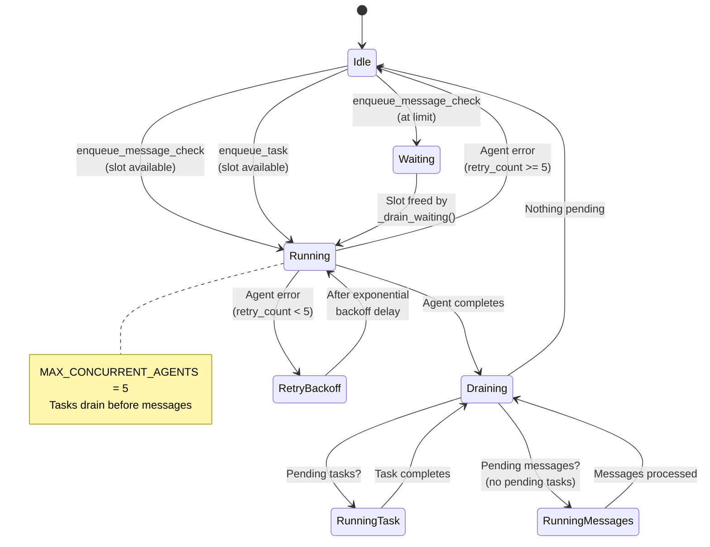
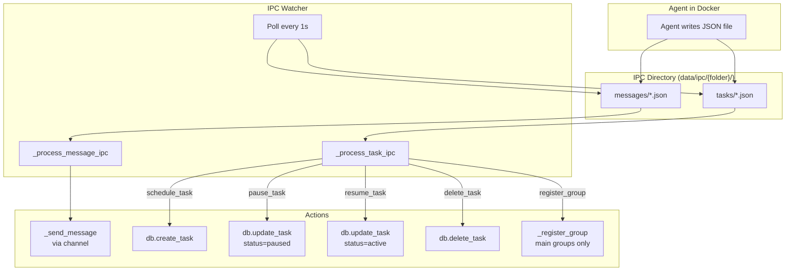
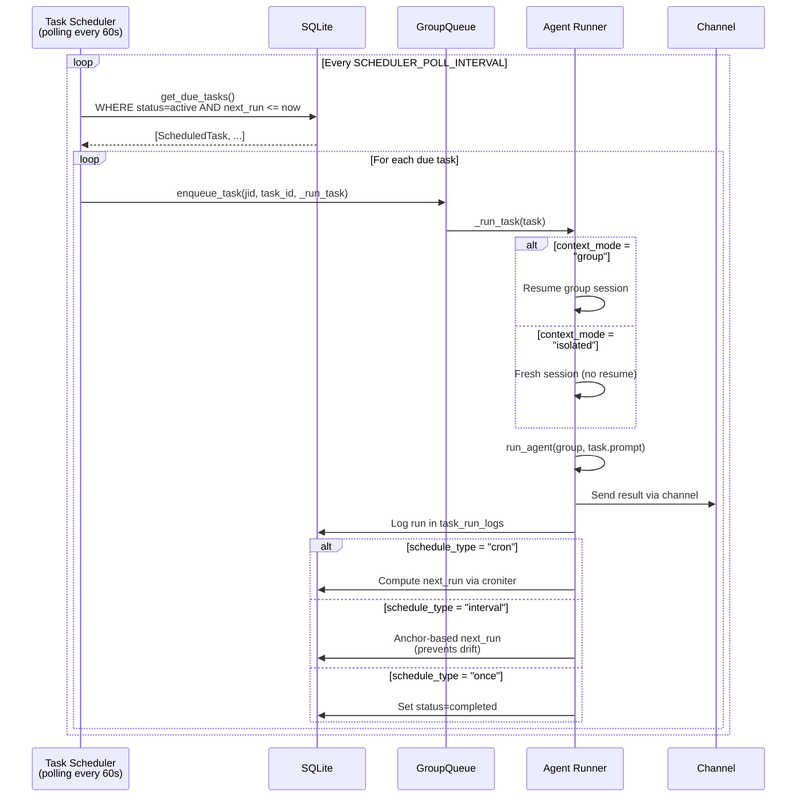
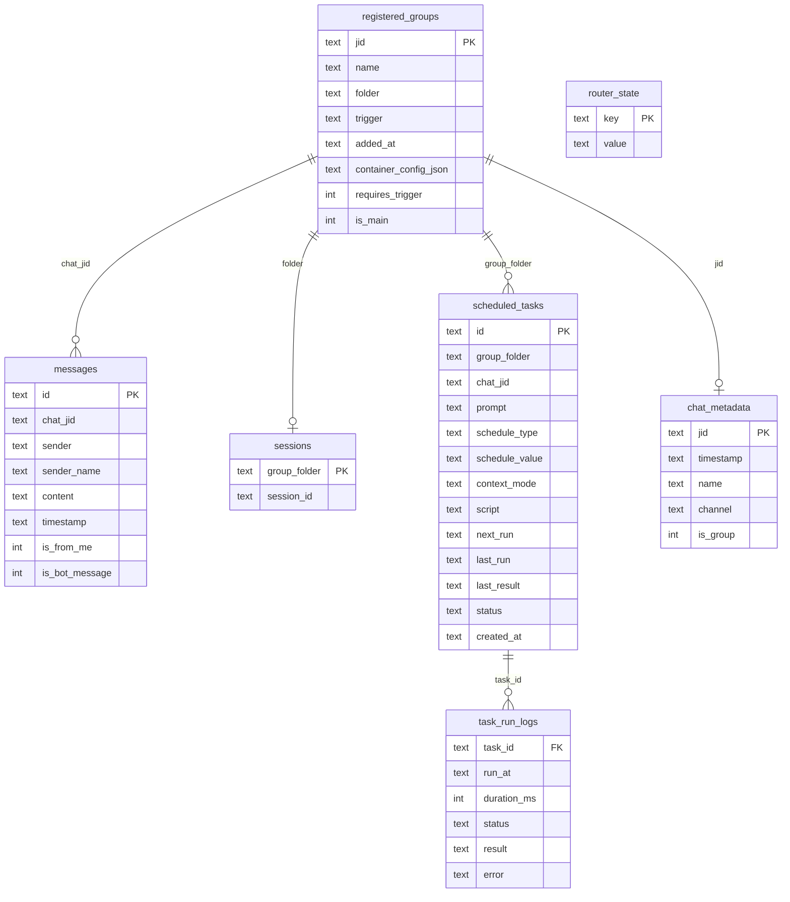

# CortexClaw Architecture

## High-level overview

CortexClaw is an orchestrator that bridges messaging channels to Snowflake Cortex Code agents. Messages arrive from channels (Slack, CLI), get persisted in SQLite, pass through a concurrency-controlled queue, and are dispatched to isolated Docker containers running the Cortex Code CLI.



## Message flow

This is the complete path a message takes from user input to agent response.



## Docker isolation

Each agent run is isolated in a fresh Docker container. The SDK's `cli_path` option accepts any executable, so a per-group shell wrapper script transparently redirects `cortex` calls into Docker.

```mermaid
graph LR
    subgraph Host
        SDK[Cortex Code<br/>Agent SDK<br/>Python]
        Wrapper[wrapper.sh<br/>per group]
        TOML[~/.snowflake/<br/>connections.toml<br/>16 connections]
        Key[~/.ssh/<br/>key.p8]
        GroupDir[groups/sales/]
        IPCDir[data/ipc/sales/]
    end

    subgraph Docker Container
        CortexCLI[cortex CLI<br/>beta channel]
        MountedTOML[/home/coco/.snowflake/<br/>connections.toml<br/>1 connection only]
        MountedKey[/home/coco/.snowflake/<br/>key.p8]
        WorkDir[/workspace/group]
        IPCMount[/workspace/ipc]
    end

    SDK -->|cli_path=wrapper.sh| Wrapper
    Wrapper -->|docker run --rm -i| CortexCLI
    TOML -.->|extract single<br/>connection| MountedTOML
    Key -.->|mount RO| MountedKey
    GroupDir -.->|mount RW| WorkDir
    IPCDir -.->|mount RW| IPCMount
```

### Credential extraction flow



## Group registration

Groups can be registered statically (config file), dynamically (channels, IPC), or loaded from the database on restart.



### JID naming conventions

| Source | JID format | Example |
|---|---|---|
| Static config | `static:<key>` | `static:sales` |
| CLI channel | `cli:default` | `cli:default` |
| Slack channel | `slack:<channel_id>` | `slack:C05ABC123` |
| IPC registration | custom | `custom:eng-team` |

## GroupQueue concurrency control

The GroupQueue serializes work per group while enforcing a global concurrency limit across all groups.



### Priority order during drain

1. **Pending tasks** (scheduled tasks are higher priority)
2. **Pending messages** (coalesced while group was active)
3. **Waiting groups** (FIFO queue of groups blocked by concurrency limit)

## IPC and task scheduling

Agents communicate back to the orchestrator through filesystem-based IPC. Scheduled tasks are persisted in SQLite and polled by the task scheduler.



### Task scheduler flow



## Data persistence

All state is persisted in a single SQLite database via `aiosqlite`.



## Directory structure at runtime

```
project-root/
├── cortexclaw/                    # Source code
├── groups/                        # Per-group working directories
│   ├── cli-default/               #   CLI channel default group
│   │   ├── CLAUDE.md              #   Optional per-group instructions
│   │   └── logs/
│   ├── sales/                     #   Static group from groups.toml
│   │   ├── CLAUDE.md
│   │   └── logs/
│   └── eng/
│       └── logs/
├── data/
│   ├── ipc/                       # IPC filesystem interface
│   │   ├── cli-default/
│   │   │   ├── messages/          #   Agent writes JSON here
│   │   │   └── tasks/
│   │   └── sales/
│   │       ├── messages/
│   │       └── tasks/
│   ├── docker-credentials/        # Temp TOML files (single connection)
│   │   └── my-connection.toml
│   └── wrappers/                  # Generated Docker wrapper scripts
│       ├── cli-default.sh
│       └── sales.sh
├── store/
│   └── cortexclaw.db              # SQLite database
├── groups.toml                    # Static group configuration
├── Dockerfile                     # Agent container image
└── .env                           # Environment configuration
```
